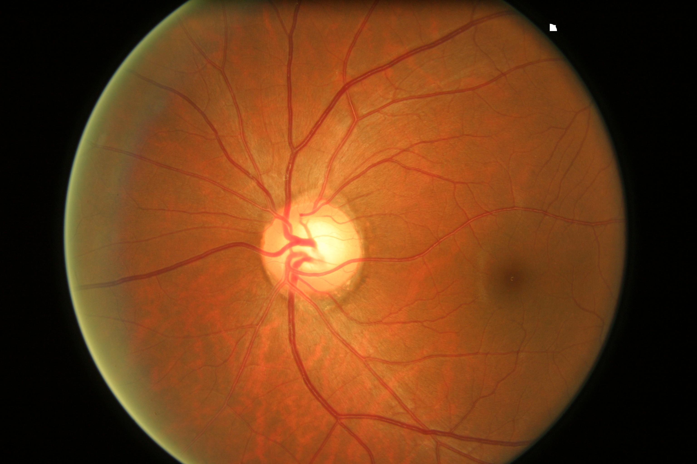

<!DOCTYPE html>
<html lang="en">
<head>
    <meta charset="UTF-8">
    <meta name="viewport" content="width=device-width, initial-scale=1.0">
    <title>Glaucoma Detection App</title>
</head>
<body>
    <h1>Glaucoma Detection App</h1>
    
A Flutter application for Glaucoma detection using machine learning.

    <h2>Project Overview</h2>
    
The Glaucoma Detection App is designed to help users assess the likelihood of having Glaucoma by analyzing eye images. The app utilizes a machine learning model for prediction and offers additional features such as storing user history, suggesting medicines, and managing user profiles.

    <h2>Features</h2>
    <ul>
        <li>Glaucoma detection using machine learning</li>
        <li>User-friendly interface for capturing eye images</li>
        <li>User profile management</li>
        <li>History tracking of Glaucoma detection results</li>
        <li>Medicine suggestions for Glaucoma patients</li>
        <li>Settings to customize user preferences</li>
    </ul>

    <h2>Getting Started</h2>
    
To run the project locally, follow these steps:

    <ol>
        <li>Clone the repository:</li>
        <pre><code>git clone https://github.com/your-username/glucoma_app_fyp.git</code></pre>
    </ol>

    <h2>Technologies Used</h2>
    <ul>
        <li>Flutter for cross-platform mobile app development</li>
        <li>Machine learning model for Glaucoma prediction</li>
        <li>Firebase for user authentication, data storage, and backend services</li>
    </ul>

    <h2>Contributing</h2>
    
Contributions are welcome! If you'd like to contribute to the project, please follow the contribution guidelines.

    <h2>License</h2>
    
This project is licensed under the MIT License.

    <h2>Acknowledgments</h2>
    
Special thanks to contributors who participated in this project.

    <h2>Contact</h2>
    
Email: gillanizain90@gmail.com

    <h2>Project Images</h2>
    
    
    
    
    
    
    
</body>
</html>
